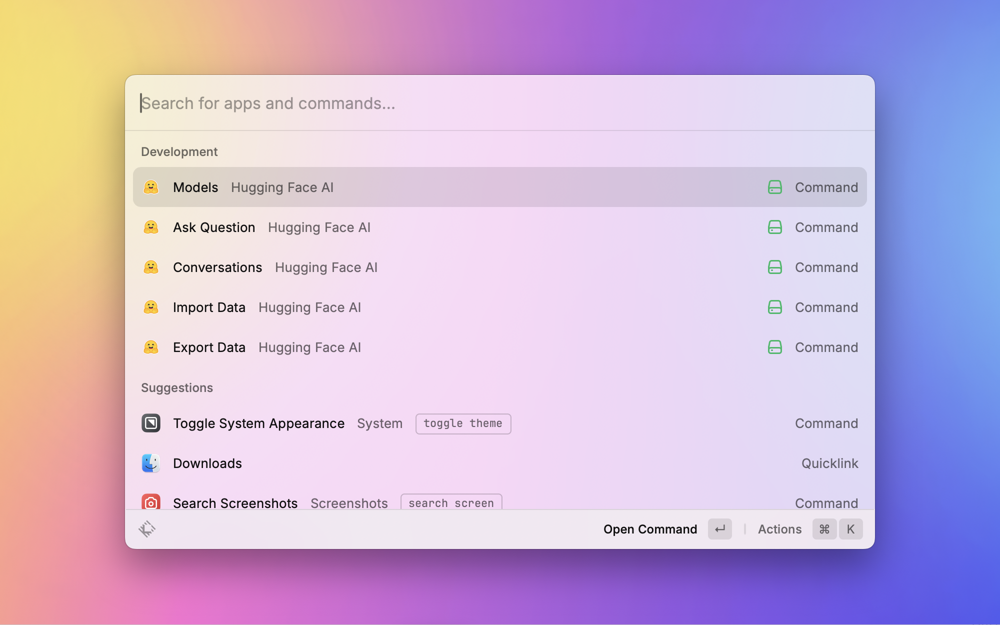
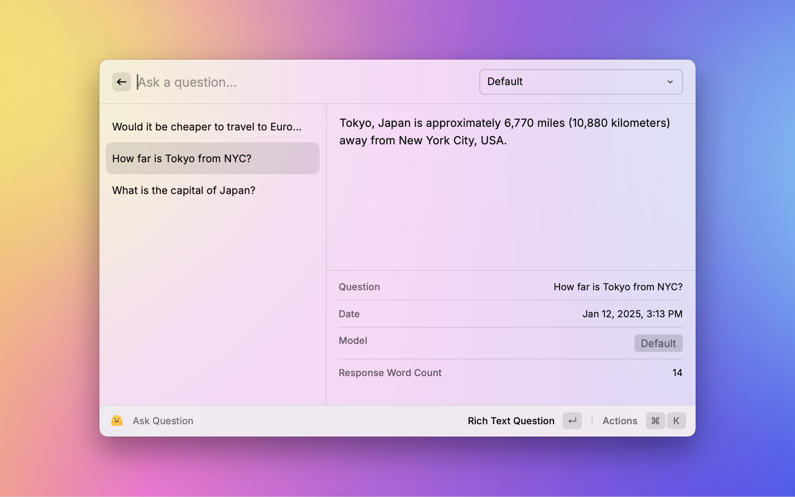
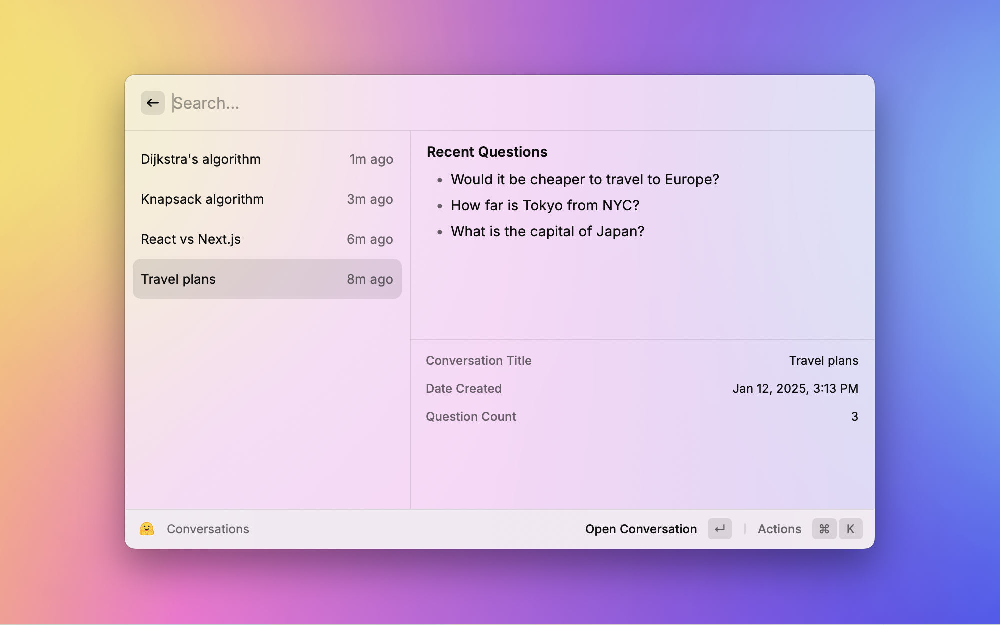
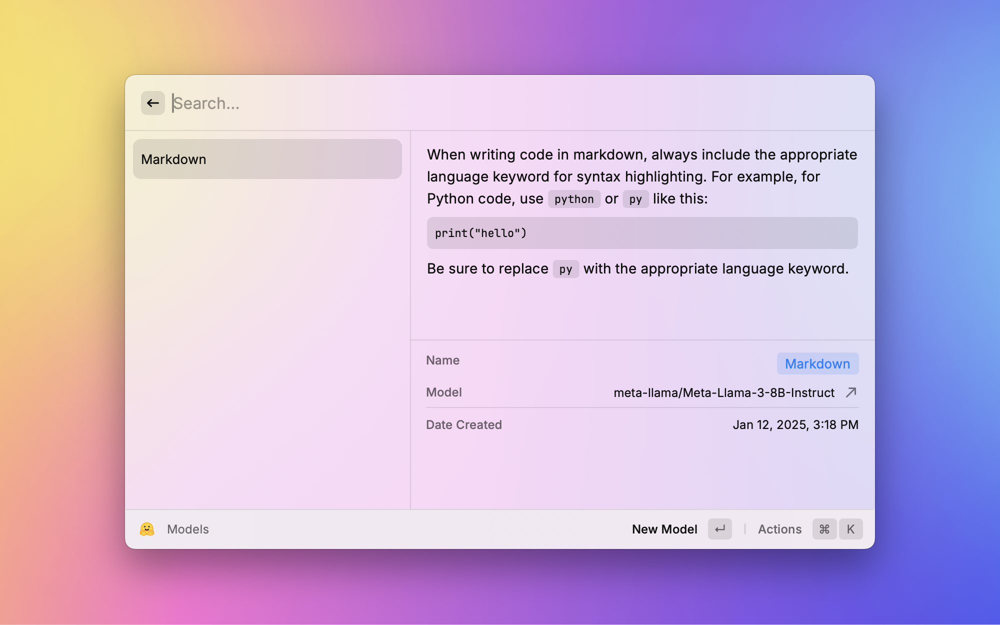

# Hugging Face AI

## Overview

The **Hugging Face AI** extension for Raycast allows users to interact with the Hugging Face Inference API seamlessly. With features like asking questions, tracking conversations, creating custom models, and exporting/importing data, this extension is a powerful tool for developers and AI enthusiasts. **All you need is a free access token!**

## Features

- **Ask Questions**: Chat with Hugging Face models directly from Raycast.
- **Conversations**: View and manage your conversation history.
- **Custom Models**: Create and manage personalized AI models.
- **Data Import/Export**: Backup or transfer your data with JSON files.

## Getting Started

### Prerequisites

- A free [Hugging Face account](https://huggingface.co/join).
- A valid Hugging Face Inference API token.
- Raycast installed on your device.

### Installation

1. Download the Hugging Face AI extension from the Raycast Store.
2. Follow the setup instructions provided by Raycast.

### Configuring Your Access Token

To use the extension, you need to configure your Hugging Face API token:

1. Log in to your Hugging Face account.
2. Navigate to [Hugging Face Tokens](https://huggingface.co/settings/tokens).
3. Click ****Create new token****
4. Enter a name (optional)
5. Select the checkbox ****Make calls to the serverless Inference API**** under ****Inference****
6. Scroll down and click ****Create token****
7. Copy your newly created access token.
8. Open the Hugging Face AI extension in Raycast.
9. Paste the token into the **Access Token** field in the preferences.

<!-- ## How to Use

1. **Ask a Question**:

   - Open Raycast and type `Ask Question`.
   - Enter your query and hit `Enter`.
   - The response will appear instantly.

2. **Manage Conversations**:

   - Open the `Conversations` command to review past chats.

3. **Custom Models**:

   - Use the `Models` command to create or modify your custom AI models.

4. **Import/Export Data**:
   - Use the `Import Data` or `Export Data` commands to backup or restore your data. -->

## Screenshots

## Dependencies

The extension requires the following packages:

- `@huggingface/inference`
- `@raycast/api`
- `@raycast/utils`
- `node-fetch`
- `uuid`

## Icon Attributions

<a href="https://www.flaticon.com/free-icons/question" title="question icons">Question icons created by sonnycandra - Flaticon</a>

<a href="https://www.flaticon.com/free-icons/conversation" title="conversation icons">Conversation icons created by Queen Creations - Flaticon</a>

<a href="https://www.flaticon.com/free-icons/knowledge-graph" title="knowledge graph icons">Knowledge graph icons created by Grafixpoint - Flaticon</a>

## License

This extension is licensed under the [MIT License](LICENSE).

## Author

Developed by **William De Rocco**. For questions or issues, feel free to open a GitHub issue or contact me directly.
